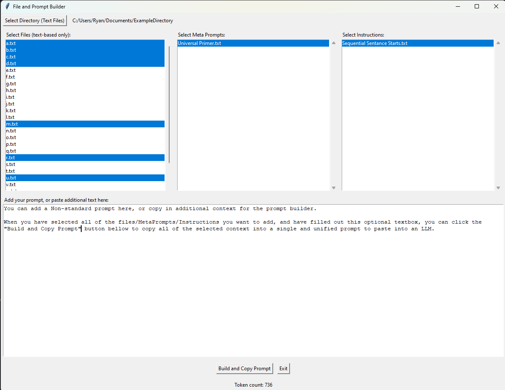

# LLMPrompt
A lightweight tool for better LLM prompt building.

Select files from a directory, and LLMPrompt will take the UTF-8 encoded text from each selected file, and concatenate the text with any MetaPrompts, Instructions, or Non-Standard/unique prompts added by the user in the provided text field.

When the selections have been made, and any user text has been added, clicking the "Build and Copy Prompt" button will copy the fully preprocessed prompt to the clipboard, for use in a LLM.  

## Acknowledgments

The main inspiration for this project is https://repoprompt.com/. The concept of using a GUI to select files to concatenate together, along with customizable, and reusable prompt components is an interesting approach. 

The MetaPrompt 'Universal Primer' is based on the CustomGPT 'Universal Primer' by Siqi Chen
https://chatgpt.com/g/g-GbLbctpPz-universal-primer