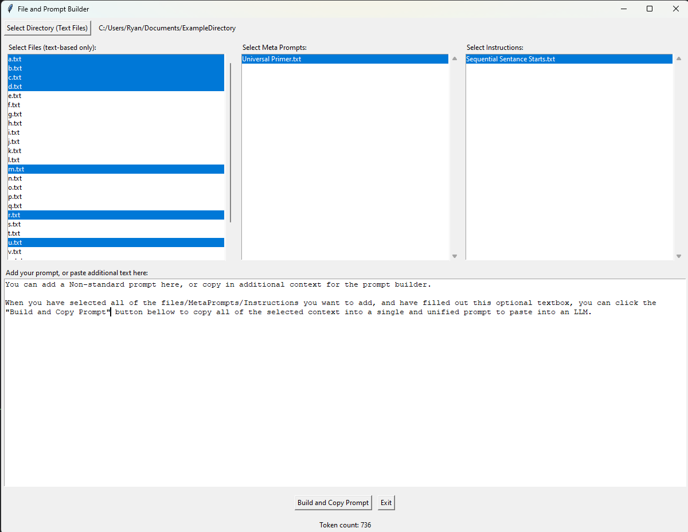

# LLMPrompt
A lightweight tool for better LLM prompt building.



LLMPrompt is a powerful GUI application that helps you build structured prompts for Large Language Models by combining multiple components: files, meta-prompts, custom instructions, and user text. All components are properly formatted with XML tags and real-time token counting using OpenAI's tiktoken.

## Features

### Core Functionality
- **Multi-file Selection**: Select and combine multiple UTF-8 text files from any directory
- **Meta Prompts**: Pre-built system prompts stored in `meta_prompts/` directory
- **Custom Instructions**: Reusable instructions from `custom_instructions/` directory
- **User Text Input**: Add custom prompts and notes directly in the application
- **XML Structuring**: All content is wrapped in proper XML tags for clear organization

### Version 2.0 Improvements
- **Preview Pane**: See your built prompt in real-time before copying
- **Save/Load Configurations**: Save your prompt setups as JSON files for reuse
- **Search & Filter**: Quickly find files with the built-in search functionality
- **Recent Directories**: Quick access to your 10 most recently used directories
- **File Count Indicators**: See selected/total counts for each section
- **Keyboard Shortcuts**: Fast workflow with Ctrl+B, Ctrl+S, Ctrl+O, Ctrl+E, Ctrl+R
- **Select All/Deselect All**: Bulk selection controls for each listbox
- **Clear Buttons**: Easy reset for each section
- **Export to File**: Save your built prompts as text files
- **Enhanced Error Handling**: More robust file operations with better error messages
- **Menu Bar**: Organized File and Help menus
- **Resizable Sections**: Drag to resize the preview pane and listboxes

### Real-time Token Counting
The application uses OpenAI's `o200k_base` encoding to provide accurate token counts as you build your prompt. This helps you stay within model token limits.

## Installation

1. Clone this repository:
```bash
git clone https://github.com/yourusername/LLMPrompt.git
cd LLMPrompt
```

2. Install dependencies:
```bash
pip install -r requirements.txt
```

3. Run the application:
```bash
python LLMPrompt.py
```

## Usage

### Basic Workflow
1. **Select a Directory**: Click "Select Directory" to choose a folder containing text files
2. **Select Files**: Choose one or more files from the Files listbox
3. **Select Meta Prompts** (optional): Choose pre-built prompts from the Meta Prompts listbox
4. **Select Instructions** (optional): Choose custom instructions from the Instructions listbox
5. **Add User Text** (optional): Type or paste additional text in the text area
6. **Preview**: See your complete prompt in the preview pane on the right
7. **Build & Copy**: Click "Build and Copy Prompt" or press Ctrl+B to copy to clipboard

### Keyboard Shortcuts
- **Ctrl+B**: Build and copy prompt to clipboard
- **Ctrl+S**: Save current configuration
- **Ctrl+O**: Load a saved configuration
- **Ctrl+E**: Export prompt to text file
- **Ctrl+R**: Refresh preview

### Saving and Loading Configurations
You can save your entire prompt setup (selected directory, files, meta prompts, instructions, and user text) as a JSON configuration file. This is useful for:
- Reusing common prompt structures
- Sharing prompt templates with team members
- Quickly switching between different project contexts

1. Set up your prompt components
2. Press Ctrl+S or use File → Save Configuration
3. Choose a location and filename
4. To reload: Press Ctrl+O or use File → Load Configuration

### File Filtering
Use the "Filter Files" search box to quickly find files by name. The filter works in real-time as you type.

### Recent Directories
The dropdown next to "Select Directory" shows your 10 most recently used directories for quick access.

## Output Format

The built prompt is structured with XML tags:

```xml
<FullPrompt>
  <MetaPrompt>
    [Selected meta prompts]
  </MetaPrompt>

  <ContextualPrompt>
    ### Contextual Prompt (from selected files) ###
    <filename1.txt>
    [file content]
    </filename1.txt>

    #########################

    <filename2.txt>
    [file content]
    </filename2.txt>
  </ContextualPrompt>

  <Instructions>
    ### Instructions ###
    [Selected custom instructions]
  </Instructions>

  <DirectPrompt>
    ### Direct Prompt from User and/or code to address ###
    [User text]
  </DirectPrompt>
</FullPrompt>
```  

## Acknowledgments

The main inspiration for this project is https://repoprompt.com/. The concept of using a GUI to select files to concatenate together, along with customizable, and reusable prompt components is an interesting approach. 

The MetaPrompt 'Universal Primer' is based on the CustomGPT 'Universal Primer' by Siqi Chen
https://chatgpt.com/g/g-GbLbctpPz-universal-primer